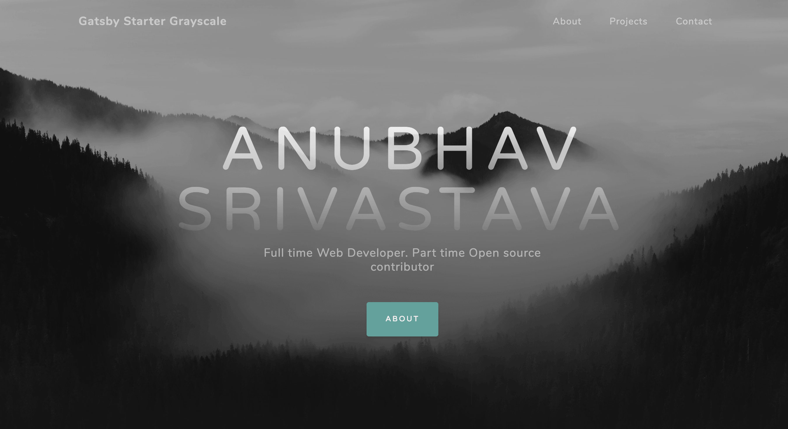

# gatsby-starter-grayscale  

Gatsby.js V2 starter template based on Grayscale by startbootstrap

For an overview of the project structure please refer to the [Gatsby documentation - Building with Components](https://www.gatsbyjs.org/docs/building-with-components/).

Check online preview [here](https://anubhavsrivastava.github.io/gatsby-starter-grayscale/)

## Screenshot



## Install

Make sure that you have the Gatsby CLI program installed:

```sh
npm install --global gatsby-cli
```

And run from your CLI:

```sh
gatsby new <site-name> https://github.com/anubhavsrivastava/gatsby-starter-grayscale
```

Then you can run it by:

```sh
cd gatsby-example-site
npm install
gatsby develop
```

### Personalization

Edit `config.js` to put up your details

```javascript
module.exports = {
  siteTitle: 'Gatsby Starter grayscale', // <title>
  ...
  heading: 'Anubhav Srivastava',
  subHeading: 'Full time Web Developer. Part time Open source contributor  ',

  // social
  socialLinks: [
    {
      icon: 'fa-github',
      name: 'Github',
      url: 'https://github.com/anubhavsrivastava',
    }
    ...
  ],
};

```

### Deploying using Github page

`package.json` has a default script that uses `gh-pages` module to publish on Github pages. Simply running `npm run deploy` would publish the site on github pages.

Additionally, it also has [path-prefix](https://www.gatsbyjs.org/docs/path-prefix/) value set for gatsby config in `config.js`. Change `pathPrefix` to relevant path if your gatsby site is hosted on subpath of a domain, `https://theanubhav.com/somePath/`. If you are hosting it as root site, i.e, `https://theanubhav.com/` , remove the pathPrefix configuration.

### Contribution

Suggestions and PRs are welcome!

Please create issue or open PR request for contribution.

### License

[](LICENSE)

refer `LICENSE` file in this repository.

# Mid-Atlantic Esotericon

Repository for the homepage of the Mid-Atlantic Esotericon, the premier Masonic Esoteric Conference. The site is built with Gatsby, using the Grayscale starter template edited to fit our needs as an organization.

## Build Badges

 

## Getting Started

This README will help the user install a local copy of the MAE site on a development machine, as well as configure the site for deployment in a production environment. For help setting up your local dev environment see the 'Prerequisites' and 'Installing' section. For deploying into the production environment, see the 'Deployment' section of the README.

### Prerequisites

What things you need to install the software and how to install them

```
Give examples
```

To get a development environment up and running on a local workstation you will need the following tools installed; Node, NPM or Yarn (this walk-through will use NPM), Git and the Gatsby CLI. This guide is assuming the user is using a Debian/Ubuntu based development environment, if you are using something different please see the installation instructions maintained by [Gatsby](https://gatsbyjs.org/tutorial/part-zero/).

#### Installing Node.js

For this case we're using nvm to install and manage Node, to start out make sure your workstation is up to date;

```sh
sudo apt update
sudo apt -y upgrade
```

If your workstation doesn't have curl installed, install it now;

`sudo apt-get install -y curl`

Once curl is installed, download and install nvm;

`curl -o- https://raw.githubusercontent.com/nvm-sh/nvm/v0.35.1/install.sh | bash`

To confirm it has properly downloaded and installed run the following command;

`nvm --version`

If properly installed, the current version of nvm should be shown on the screen.

##### Set Default Node Version

Install and set the version of Node.js you want to run on your workstation;

```sh
nvm install 11.14.0
nvm use 11.14.0
```

To confirm it has been properly installed, run the following commands;

```sh
node --version
npm --version
```

If properly installed you should see version numbers respectively for Node and NPM.

#### Install Git

To install Git, run the following commands;

```sh
sudo apt-get update
sudo apt-get install -y git
```

To confirm it has been properly instlled, run the following command;

`git --version`

If properly installed you should see the version number. Next configure your git client;

```sh
git config --global user.name "Your Name"
git config --global user.email "yourname@example.com"
```

#### Install the Gatsby CLI

Install the Gatsby CLI on your workstation;

`npm install -g gatsby-cli`

Confirm Gatsby has been properly installed;

`gatsby --version`

If Gatsby has properly installed, you should see the installed version number on your screen.

### Installing

A step by step series of examples that tell you how to get a development env running

Say what the step will be

```
Give the example
```

And repeat

```
until finished
```

End with an example of getting some data out of the system or using it for a little demo

## Running the tests

Explain how to run the automated tests for this system

### Break down into end to end tests

Explain what these tests test and why

```
Give an example
```

### And coding style tests

Explain what these tests test and why

```
Give an example
```

## Deployment

Add additional notes about how to deploy this on a live system

## Built With

* [Dropwizard](http://www.dropwizard.io/1.0.2/docs/) - The web framework used
* [Maven](https://maven.apache.org/) - Dependency Management
* [ROME](https://rometools.github.io/rome/) - Used to generate RSS Feeds

## Contributing

Please read [CONTRIBUTING.md](https://gist.github.com/PurpleBooth/b24679402957c63ec426) for details on our code of conduct, and the process for submitting pull requests to us.

## Versioning

We use [SemVer](http://semver.org/) for versioning. For the versions available, see the [tags on this repository](https://github.com/your/project/tags). 

## Authors

* **Billie Thompson** - *Initial work* - [PurpleBooth](https://github.com/PurpleBooth)

See also the list of [contributors](https://github.com/your/project/contributors) who participated in this project.

## License

This project is licensed under the MIT License - see the [LICENSE.md](LICENSE.md) file for details

## Acknowledgments

* Hat tip to anyone whose code was used
* Inspiration
* etc
